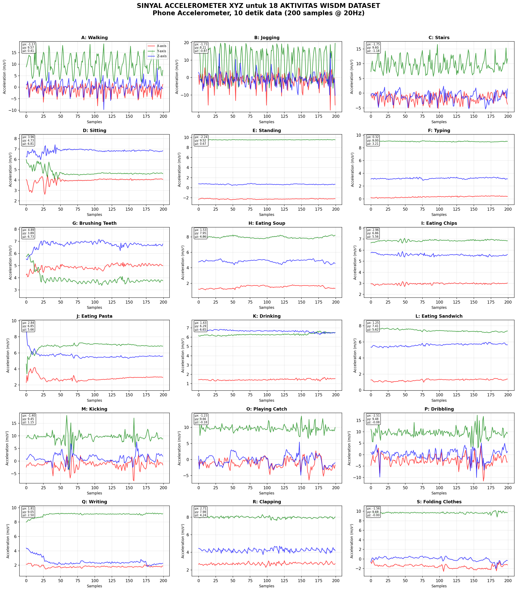
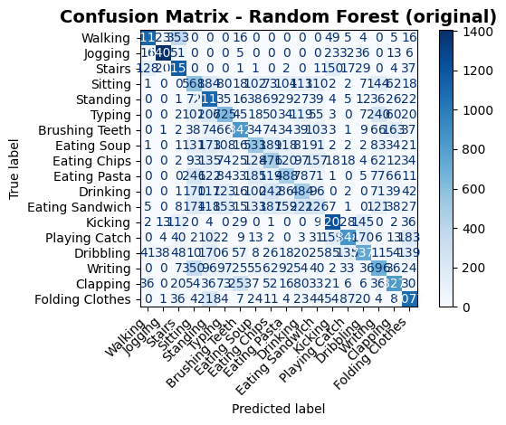

# Human Activity Recognition using WISDM Dataset

This project explores Human Activity Recognition (HAR) using smartphone sensor data from the WISDM dataset. Three approaches were evaluated: Random Forest, Convolutional Neural Network (CNN), and a CNN-LSTM hybrid architecture. The models were compared to determine the most effective method for classifying human activities from sensor signals.

## Team Members

- Annisa Primahapsari 
- Kharisma Maksum Setiadi 
- Raden Satrio Hibatull Rasendriyo 

## Problem Statement

Human Activity Recognition (HAR) is a machine learning application that aims to automatically identify human activities using sensor data collected from smartphones and wearable devices. Accelerometer and gyroscope signals are complex time-series data, making activity classification a challenging task.

This project investigates the performance of traditional machine learning and deep learning approaches for recognizing human activities and identifies the most effective model for the WISDM dataset.

## Objectives

- Perform exploratory data analysis on the WISDM dataset.
- Build and evaluate a Random Forest classifier.
- Build and evaluate a CNN model.
- Build and evaluate a CNN-LSTM hybrid model.
- Compare model performance using classification metrics.
- Analyze the advantages and limitations of each approach.

## Dataset

This project uses the WISDM (Wireless Sensor Data Mining) dataset containing smartphone accelerometer and gyroscope sensor readings for various human activities.

Dataset source:

[WISDM Dataset](https://www.kaggle.com/datasets/mashlyn/smartphone-and-smartwatch-activity-and-biometrics)

## Project Structure

```text
├── images/
│   ├── all_18_activities_signals.png
│   ├── comparison.png
│   ├── output.png
│   ├── output cnn.png
│   └── phone_accel_detailed.png
|   └── phone_gyro_detailed.png
│
├── notebooks/
│   └── WISDM_HAR_Analysis.ipynb
│
├── README.md
└── .gitignore
```

## Methods

### Random Forest

A traditional machine learning model trained using engineered features extracted from sensor signals.

### Convolutional Neural Network (CNN)

A deep learning architecture designed to automatically learn spatial patterns from time-series sensor data.

### CNN-LSTM Hybrid

A hybrid deep learning architecture that combines CNN and LSTM layers. CNN extracts local features from sensor signals, while LSTM captures temporal dependencies and sequential patterns in human activities.

## Results

| Model | Accuracy |
|---------|----------|
| Random Forest | 50.6% |
| CNN | 49.3% |
| CNN-LSTM | 69.8% |

### Performance Comparison

| Metric | Random Forest | CNN | CNN-LSTM |
|----------|----------|----------|----------|
| Precision | 0.51 | 0.49 | 0.70 |
| Recall | 0.50 | 0.49 | 0.70 |
| F1-Score | 0.50 | 0.48 | 0.69 |

The CNN-LSTM model achieved the highest performance with an accuracy of 69.8%, outperforming both Random Forest and CNN models. The results indicate that combining convolutional feature extraction with temporal sequence modeling provides better activity recognition performance.

## Visualizations

### Sensor Signals



### Confusion Matrix




### Model Comparison Performance


## Technologies Used

- Python
- Pandas
- NumPy
- Matplotlib
- Seaborn
- Scikit-learn
- TensorFlow
- Keras
- Jupyter Notebook

## How to Run

1. Clone this repository.
2. Download the WISDM dataset.
3. Install required dependencies.
4. Open the notebook in Jupyter Notebook or Google Colab.
5. Run all cells sequentially.

## Conclusion

This project demonstrates the application of machine learning and deep learning techniques for Human Activity Recognition. Among the evaluated models, the CNN-LSTM hybrid architecture achieved the best performance, highlighting the importance of capturing both spatial and temporal patterns in sensor-based activity classification tasks.
